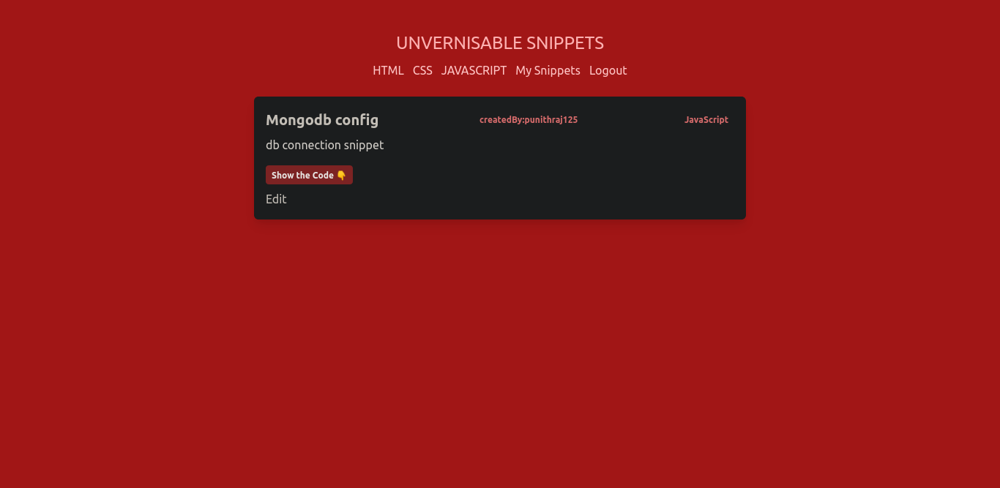

## Getting Started

1. [Sign up for a free account at FaunaDB](http://bit.ly/jqqfauna).

2. Copy the `.env.local.example` file to `.env.local` and fill in your `FAUNA_SECRET`.

3. Create a collection in Fauna called `snippets`.

4. Create a auth0 account from [auth0 free account](https://auth0.com/signup?&signUpData=%7B%22category%22%3A%22docs%22%7D)

5. Fill the details in the .env.local file such as client id ,secret etc

6. Run the development server:

```bash
npm run dev
# or
yarn dev
```

Open [http://localhost:3000](http://localhost:3000) with your browser to see the result.
